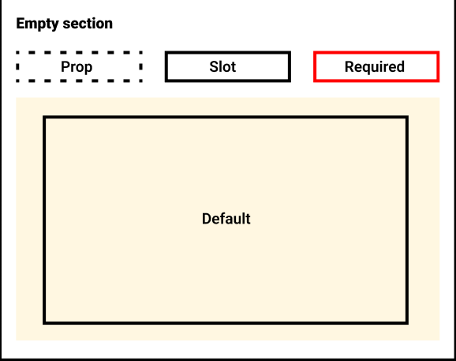
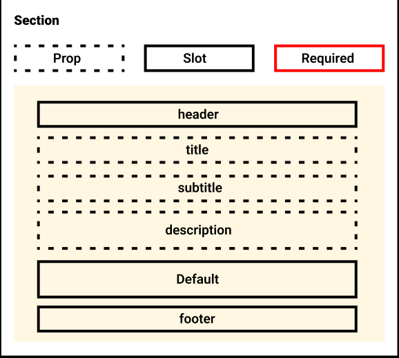
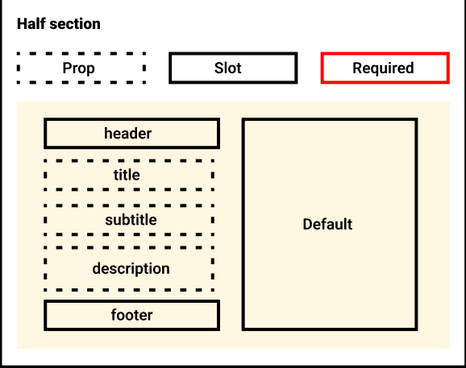

# 🚀 Astro sections

### [📘 Documentation →](https://astros.warps.io/documentation)

### [🧑‍🚀 Astro website →](https://astro.build/)

This components are designed to allow creation of structured website sections. They define a set of standard classes to be easyly customizzable, you can check an example here: https://github.com/warpsio/astros

## How To Use

In any of your Astro pages, import the sections you need

```astro
---
/* Import the components you need */
import { Section, ImageSection, HalfSection, EmptySection, Hero } from "astro-sections";
---

<html lang="en">
	<head>
		<SEO title="A Very Descriptive Title" description="A heavily optimized description full of well-researched keywords." />
	</head>
	<head>
		<body>
			<Hero {...props} />
			<ImageSection {...props} />
			<HalfSection {...props} />
			<EmptySection {...props} />
			<Section {...props} />
		</body>
	</head>
</html>
```

## Supported Props

### EmptySection

| Propname  | Type   | Default | Required | Description                          |
| --------- | ------ | ------- | -------- | ------------------------------------ |
| id        | string | null    |          | Id to add to section element         |
| class     | string | null    |          | Class to add to section element      |
| alt       | bool   | false   |          | Add "alt" class to <section> element |
| container | bool   | true    |          | Add "container" class                |



### Section

| Propname    | Type   | Default | Required | Description                                                                   |
| ----------- | ------ | ------- | -------- | ----------------------------------------------------------------------------- |
| id          | string | null    |          | Id to add to section element                                                  |
| title       | string | null    |          | Title, check position in the chart (Have to pass lmap for localization)       |
| subtitle    | string | null    |          | subtitle, check position in the chart (Have to pass lmap for localization)    |
| description | string | null    |          | Description, check position in the chart (Have to pass lmap for localization) |
| class       | string | null    |          | Class to add to section element                                               |
| alt         | bool   | false   |          | Add "alt" class to <section> element                                          |
| container   | bool   | true    |          | Add "container" class                                                         |
| lmap        | Object | {}      |          | Localization map, needed for localization of title, subtitle and description  |



### Half Section

| Propname          | Type   | Default | Required | Description                                                                   |
| ----------------- | ------ | ------- | -------- | ----------------------------------------------------------------------------- |
| id                | string | null    |          | Id to add to section element                                                  |
| title             | string | null    |          | Title, check position in the chart (Have to pass lmap for localization)       |
| subtitle          | string | null    |          | subtitle, check position in the chart (Have to pass lmap for localization)    |
| description       | string | null    |          | Description, check position in the chart (Have to pass lmap for localization) |
| class             | string | null    |          | Class to add to section element                                               |
| alt               | bool   | false   |          | Add "alt" class to <section> element                                          |
| container         | bool   | true    |          | Add "container" class                                                         |
| inverted          | bool   | true    |          | Invert position of the 2 sides                                                |
| verticalAlignment | string | "start" |          | Vertical alignment for title and description side                             |
| lmap              | Object | {}      |          | Localization map, needed for localization of title, subtitle and description  |


